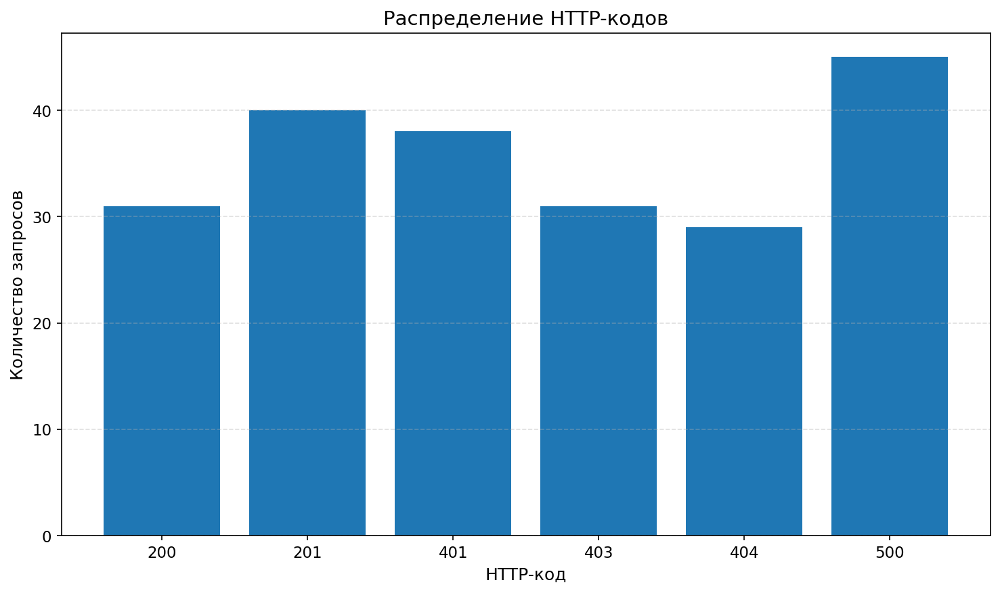
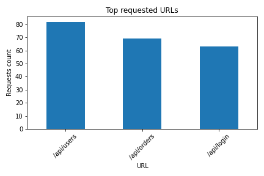
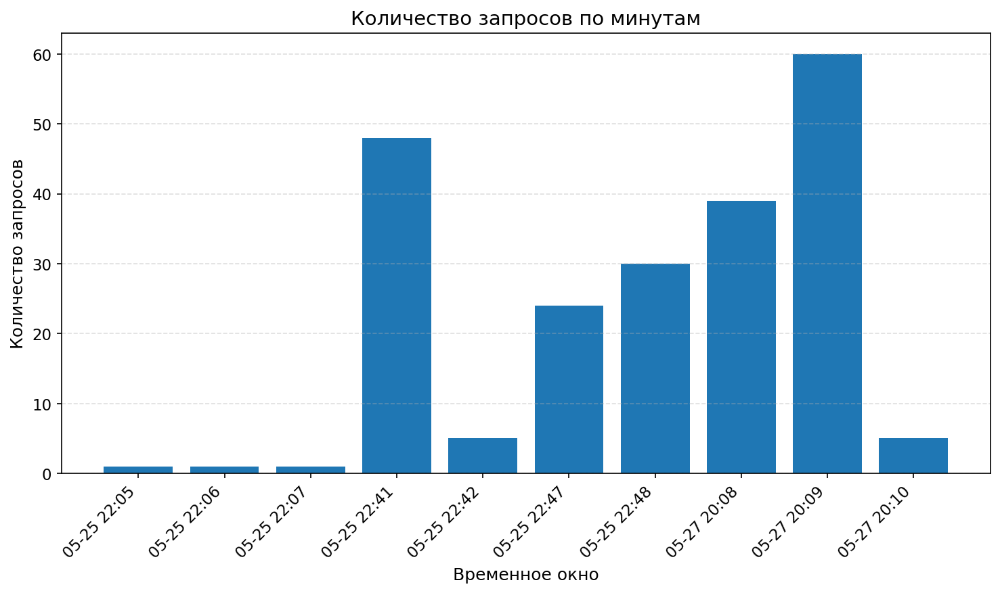
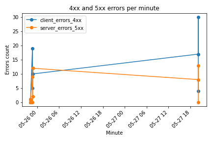

# Log Streaming Monitoring

Учебная система для потокового мониторинга web-логов.

Проект имитирует работу сервиса, который получает логи веб-приложения в реальном времени, передаёт их через Kafka, обрабатывает поток в Spark, сохраняет сырые и очищенные данные в HDFS, создаёт Hive-таблицу для SQL-аналитики и строит графики в Jupyter Notebook.

Система позволяет анализировать активность пользователей, HTTP-коды, популярные URL, нагрузку по времени и простые аномалии: большое количество ошибок или подозрительно высокую активность с одного IP-адреса.

## Демонстрация работы

Короткое видео показывает работу основной потоковой части проекта:

1. Producer генерирует web-логи.
2. Kafka принимает сообщения в topic `web_logs`.
3. Kafka Consumer отображает полученные JSON-сообщения.
4. Spark Structured Streaming читает поток из Kafka и выводит обработанные batch-таблицы.

Видео: [`docs/media/demo.mp4`](docs/media/demo.mp4)

## Pipeline

Python Producer → Kafka → Spark Structured Streaming → HDFS → Hive → SQL-аналитика → Jupyter-визуализация

## Стек

- Python 3
- Apache Kafka
- ZooKeeper
- Apache Spark / PySpark
- Spark Structured Streaming
- HDFS
- Apache Hive
- Jupyter Notebook
- pandas
- matplotlib

## Структура проекта

- `producer/log_producer.py` — генерация тестовых web-логов и отправка в Kafka.
- `streaming/streaming_app.py` — потоковая обработка логов через Spark.
- `sql/create_hive_table.sql` — создание Hive-базы и external table.
- `sql/analytics_queries.sql` — базовая SQL-аналитика.
- `sql/window_queries.sql` — аналитика по временным окнам.
- `sql/anomaly_queries.sql` — простое выявление аномалий.
- `notebooks/log_visualization.ipynb` — визуализация результатов.
- `notebooks/log_visualization_executed.ipynb` — выполненная версия ноутбука.
- `visualization/data/` — TSV-файлы для графиков.
- `visualization/charts/` — готовые PNG-графики.
- `output/` — результаты выполнения Hive-запросов.

## Формат логов

Producer отправляет логи в JSON-формате.

Пример записи:

```json
{
  "ip": "192.168.1.10",
  "timestamp": "2026-05-25 22:41:12",
  "method": "GET",
  "url": "/api/users",
  "status_code": 500,
  "response_size": 2715,
  "user_agent": "curl/7.68.0"
}
```

## Запуск Kafka

Kafka находится в директории `/home/student/kafka`.

```bash
export KAFKA_HOME=/home/student/kafka
export PATH=$KAFKA_HOME/bin:$PATH

$KAFKA_HOME/bin/zookeeper-server-start.sh -daemon $KAFKA_HOME/config/zookeeper.properties
$KAFKA_HOME/bin/kafka-server-start.sh -daemon $KAFKA_HOME/config/server.properties
```

Проверка топика:

```bash
$KAFKA_HOME/bin/kafka-topics --list --bootstrap-server localhost:9092
```

Используемый топик: `web_logs`.

## Запуск Producer

```bash
cd ~/log-streaming-monitoring
python3 producer/log_producer.py
```

Producer генерирует тестовые web-логи и отправляет их в Kafka topic `web_logs`.

## Запуск Spark Streaming

```bash
cd ~/log-streaming-monitoring

spark-submit \
  --packages org.apache.spark:spark-sql-kafka-0-10_2.12:3.1.2 \
  streaming/streaming_app.py
```

Spark-приложение читает данные из Kafka, парсит JSON, приводит поля к нужным типам, удаляет некорректные записи и сохраняет данные в HDFS.

## HDFS

Сырые данные:

`/user/student/log_monitoring/raw_logs`

Обработанные данные:

`/user/student/log_monitoring/processed_logs`

Checkpoint-директории:

`/user/student/log_monitoring/checkpoints/raw_logs`

`/user/student/log_monitoring/checkpoints/processed_logs`

Проверка:

```ba
hdfs dfs -ls /user/student/log_monitoring
hdfs dfs -ls /user/student/log_monitoring/processed_logs
```

## Hive

Создание базы и таблицы:

```bash
hive -f sql/create_hive_table.sql
```

Основная таблица:

`log_monitoring.processed_logs`

Проверка:

```bash
hive -e "
USE log_monitoring;
SELECT COUNT(*) FROM processed_logs;
SELECT * FROM processed_logs LIMIT 5;
"
```

## SQL-аналитика

```bash
hive -f sql/analytics_queries.sql
hive -f sql/window_queries.sql
hive -f sql/anomaly_queries.sql
```

Реализована аналитика:

- общее количество запросов;
- распределение HTTP-кодов;
- топ URL;
- топ IP-адресов;
- распределение HTTP-методов;
- количество запросов по минутам;
- ошибки 4xx/5xx по минутам;
- простые аномалии по активности и ошибкам.

## Визуализация

Ноутбук:

`notebooks/log_visualization.ipynb`

Выполненная версия:

`notebooks/log_visualization_executed.ipynb`

Графики сохраняются в папку:

`visualization/charts/`

Построены графики:

- распределение HTTP-кодов;
- топ URL;
- топ IP-адресов;
- распределение HTTP-методов;
- количество запросов по минутам;
- ошибки 4xx/5xx по минутам.

## Результаты визуализации

### Распределение HTTP-кодов



### Топ URL



### Количество запросов по минутам



### Ошибки 4xx/5xx по минутам



## Проверенный результат

Проверено:

- Kafka topic `web_logs` работает;
- Producer отправляет сообщения;
- Spark Structured Streaming читает поток из Kafka;
- данные сохраняются в HDFS;
- Hive читает обработанные Parquet-данные;
- SQL-запросы выполняются;
- Jupyter Notebook выполняется без ошибок;
- PNG-графики построены.

Текущая проверка Hive показала, что таблица `processed_logs` содержит 214 записей.

## Итог

Проект демонстрирует полный учебный pipeline обработки потоковых данных:

получение логов → потоковая обработка → хранение в HDFS → SQL-анализ → визуализация.
